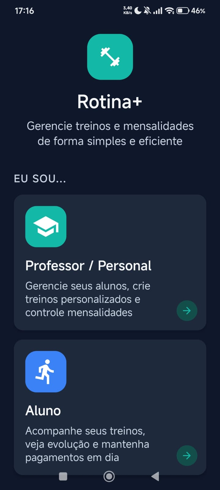
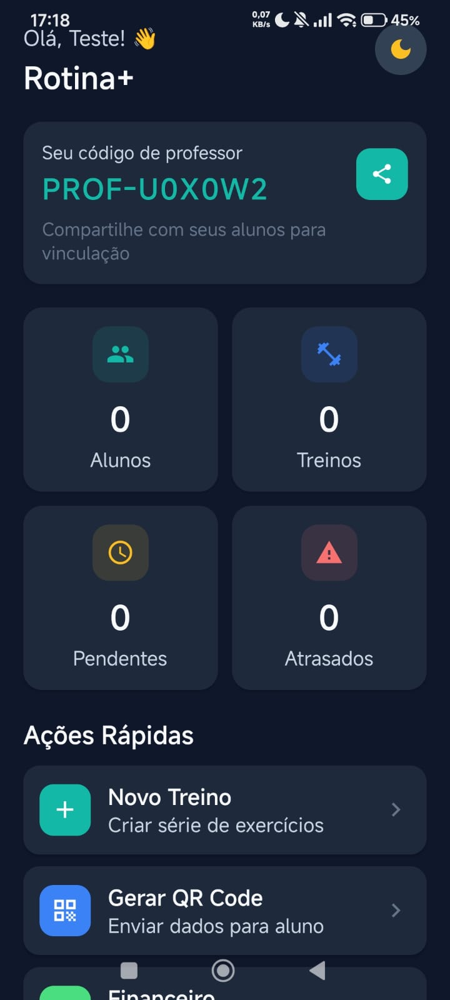
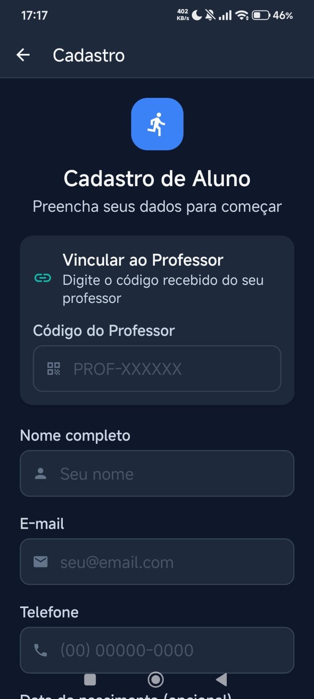
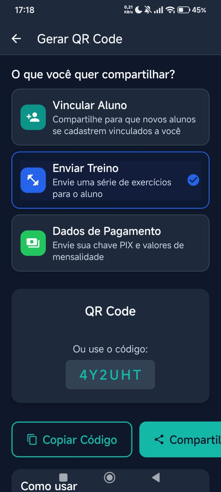
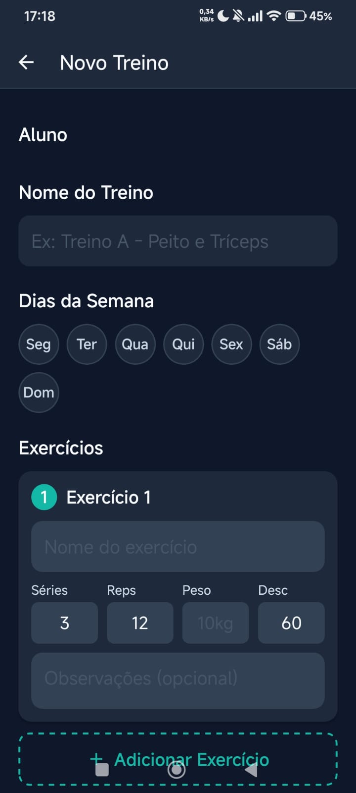
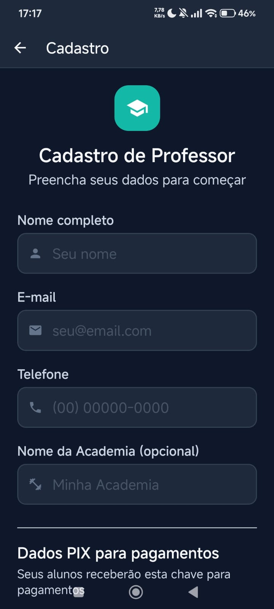
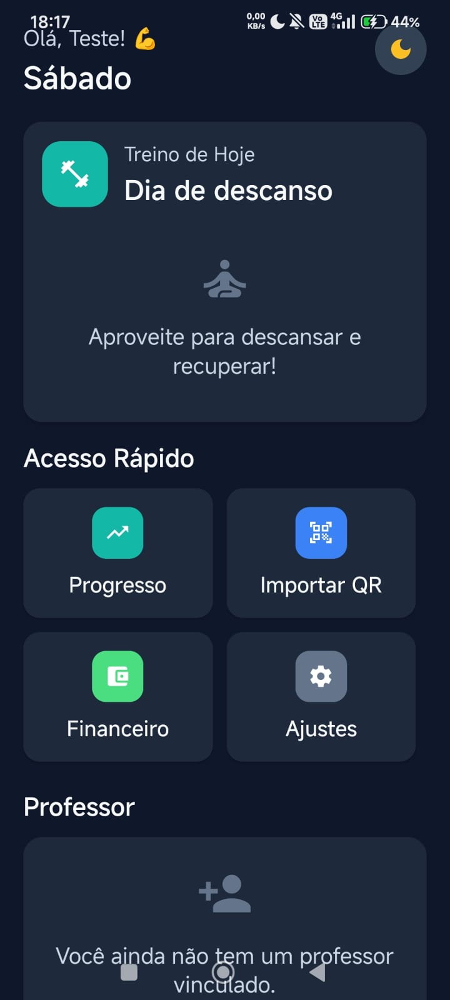
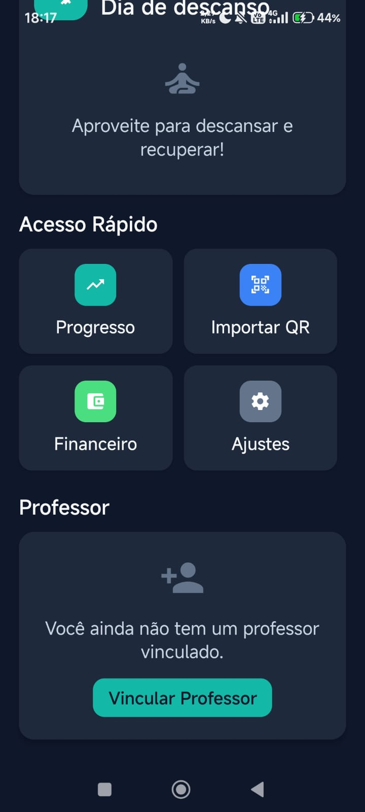
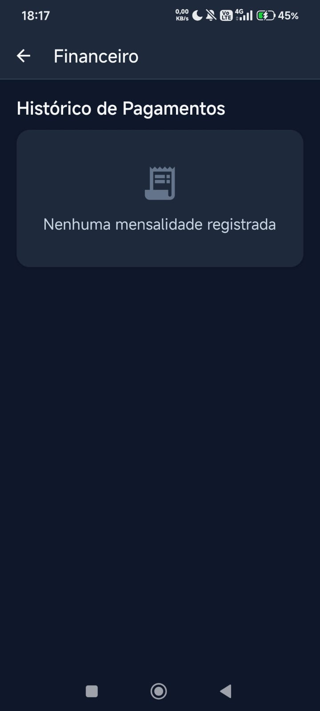

<div align="center">
  
  
  # RotinaPlus 🏋️
  
  **A Solução Completa para Academias e Personal Trainers**
  
  [](https://github.com/JonJonesBR/RotinaPlus-App-para-Academia/releases)
  [](LICENSE)
  [](https://reactnative.dev/)
  [](https://expo.dev/)
  
  [📱 Download APK v0.0.8](https://github.com/JonJonesBR/RotinaPlus-App-para-Academia/releases/download/v0.0.8/RotinaPlus-v0.0.8.apk) • [📖 Documentação](#-uso) • [🤝 Contribuir](#-contribuição)
</div>

---

## 📖 Sobre

O **RotinaPlus** é um aplicativo robusto e inovador desenvolvido para modernizar a gestão de treinos e alunos. Com sua arquitetura **Dual Mode**, ele atende tanto **Professores/Academias** quanto **Alunos**, oferecendo uma experiência personalizada e segura para cada perfil.

O app foca na segurança dos dados (armazenamento local criptografado), facilidade de compartilhamento (QR Codes offline) e usabilidade premium.


---

## 📱 Galeria do App

> Interface moderna, intuitiva e em Dark Mode para economizar bateria e oferecer a melhor experiência.

### 🏠 Acesso e Boas-vindas
<div align="center">
  
</div>

### 👨‍🏫 Área do Professor
<div align="center">
  
  
  
</div>
<div align="center">
  
  
  
</div>
<div align="center">
  
  
  
</div>
<div align="center">
  
  
</div>

### 🏋️ Área do Aluno
<div align="center">
  
  
  
</div>
<div align="center">
  
  
  
</div>
<div align="center">
  
</div>

---

## ✨ Funcionalidades Principais

### 🔐 Segurança e Autenticação
- **Modo Dual**: Interface adaptativa para Professor ou Aluno.
- **Proteção Biométrica**: Suporte a FaceID/TouchID para acesso rápido e seguro.
- **PIN de Segurança**: Bloqueio por senha numérica como fallback.
- **Criptografia**: Dados sensíveis armazenados com `SecureStore` e hash SHA-256.

### 👨‍🏫 Modo Professor
- **Gestão de Alunos**: Cadastro completo, histórico e status de pagamento.
- **Montagem de Treinos**: Ferramenta flexível para criar rotinas personalizadas (Séries, Repetições, Carga, Descanso).
- **QR Code Export**: Compartilhe treinos e vínculos com alunos instantaneamente via QR Code.
- **Gestão Financeira**: Controle de mensalidades, chaves PIX e status de pagamentos.

### 🏋️ Modo Aluno
- **Dashboard Personalizado**: Visualização clara dos treinos do dia.
- **QR Code Import**: Receba treinos e vincule-se ao professor escaneando um código.
- **Histórico**: Acompanhe a frequência e evolução.
- **Carteira Digital**: Informações de pagamento e status da mensalidade.

### 📡 Sincronização Offline (QR Sync)
- Tecnologia proprietária de transferência de dados via QR Code.
- Funciona sem internet: O professor gera o código, o aluno escaneia e os dados são transferidos localmente.
- Assinatura digital para garantir a integridade dos dados.

---

## 🚀 Instalação e Desenvolvimento

### Pré-requisitos
- [Node.js](https://nodejs.org/) (v18+)
- [Expo CLI](https://docs.expo.dev/get-started/installation/)
- Dispositivo Android/iOS ou Emulador

### Configuração do Ambiente
1. **Clone o repositório**
   ```bash
   git clone https://github.com/JonJonesBR/RotinaPlus-App-para-Academia.git
   cd RotinaPlus-App-para-Academia
   ```

2. **Instale as dependências**
   ```bash
   npm install
   ```

3. **Inicie o servidor**
   ```bash
   npx expo start
   ```

4. **Testes** (Opcional)
   ```bash
   npm test
   ```

---

## 📂 Estrutura do Projeto

```
RotinaPlus-App-para-Academia/
├── src/
│   ├── components/         # UI Kit reutilizável (Cards, Buttons, Inputs)
│   ├── screens/
│   │   ├── auth/           # Telas de Login, PIN, Biometria
│   │   ├── professor/      # Dashboard e ferramentas do Professor
│   │   ├── aluno/          # Dashboard e ferramentas do Aluno
│   │   └── common/         # Telas compartilhadas
│   ├── services/           # Camada de Serviços
│   │   ├── authService.js      # Lógica de Autenticação
│   │   ├── cryptoService.js    # Criptografia e Segurança
│   │   ├── storageService.js   # Persistência de Dados (AsyncStorage)
│   │   ├── qrCodeService.js    # Geração/Leitura de QR Codes
│   │   └── notificationService.js # Notificações Locais
│   ├── models/             # Definições de Tipos e Factories
│   ├── utils/              # Formatadores e Helpers
│   └── theme/              # Tokens de Design e Tema Escuro/Claro
├── assets/                 # Imagens e Fontes
├── __tests__/              # Testes Unitários (Jest)
├── App.js                  # Entry Point e Configuração de Contextos
└── app.json                # Configuração Expo (Plugins, Permissões)
```

---

## 🗺️ Roadmap & Status

- [x] ✅ **Refatoração UI/UX (Design System Premium)**
- [x] ✅ **Modo Dual (Aluno/Professor)**
- [x] ✅ **Sistema de Autenticação (PIN/Biometria)**
- [x] ✅ **Sincronização via QR Code (QR Sync)**
- [x] ✅ **Notificações Locais**
- [x] ✅ **Cobertura de Testes Unitários**
- [ ] ☁️ Backup em Nuvem (Futuro)
- [ ] 📊 Gráficos de Evolução Avançados (Futuro)
- [ ] 🍎 Publicação na App Store (Futuro)

---

## 🤝 Contribuição

Contribuições são bem-vindas! Siga o fluxo de **Feature Branch**:

1. Fork o projeto.
2. Crie sua branch (`git checkout -b feature/AmazingFeature`).
3. Commit suas mudanças (`git commit -m 'feat: Add some AmazingFeature'`).
4. Push para a branch (`git push origin feature/AmazingFeature`).
5. Abra um Pull Request.

---

## 📜 Licença

Este projeto está licenciado sob a **Licença MIT**.

---

<div align="center">
  Desenvolvido com excelência por <b>JonJonesBR</b>
</div>
